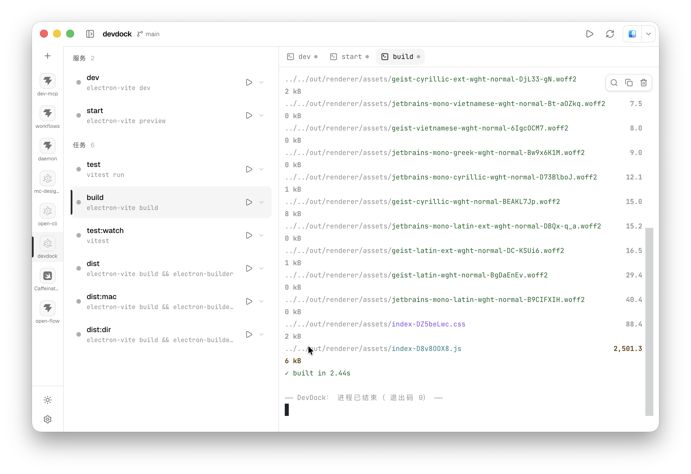

# DevDock

A lightweight desktop app for managing your local projects' dev scripts. Add a project
folder, DevDock scans its runnable scripts (`package.json`, and more), and lets you start /
stop / restart them, watch their live terminals, track status, and edit their `.env` files —
all from one window.

> macOS-first, built with Electron + React. Black / white / gray, keyboard-friendly,
> terminal-forward.

<p align="center">
  
</p>

## Features

- **Project sidebar** — add folders (button or drag-and-drop), rename, pin to top, drag to
  reorder, collapse to an icon rail. Each project shows a live "running" count.
- **Script management** — scans `package.json` scripts, groups them into **services**
  (long-running: `dev` / `serve` / `preview` …) and **tasks** (one-shot: `build` / `test` …),
  with monorepo workspace awareness. Start / stop / restart with status, PID, uptime, and the
  detected dev-server URL (clickable, incl. portless `*.localhost`).
- **Real terminals** — each running script gets a full `xterm.js` terminal (powered by
  `node-pty`); interactive input, search, and a unified tab strip shared with the env editor.
- **Env editor** — detects `.env` / `.env.*` files, edits them in an embedded CodeMirror
  editor (syntax highlight, save, reload-on-external-change). Project `.env` / `.env.local`
  are injected into the script's environment when you run it.
- **Open with** — detects installed editors & terminals (Cursor, VS Code, Zed, PyCharm,
  iTerm, Ghostty, Warp, …) and opens the project folder in your app of choice.
- **portless integration** — optional per-script toggle to launch a dev server through
  [portless](https://portless.sh/) for clean `https://<name>.localhost` URLs. Detected at
  startup; gracefully falls back to a normal run when not installed.
- **Auto-detect changes** — watches `package.json` / workspace config / `.env` files and
  refreshes the script list (and prompts to restart a running script whose definition changed).
- **Resizable, collapsible panels**, light / dark / system theme, restored tabs across
  restarts, and confirm-before-quit that cleans up child processes.

## Tech stack

Electron · `electron-vite` · React 19 · TypeScript · Tailwind CSS 4 · shadcn/ui ·
`xterm.js` · `node-pty` · CodeMirror 6 · Zustand · Vitest. Package manager: **bun**.

## Getting started

Requires **bun** and **Node.js 24+**.

```bash
bun install
bun run dev      # launch the app in dev mode
```

> First install: if the Electron binary doesn't download automatically, run
> `bun pm trust electron && bun install`.

## Scripts

```bash
bun run dev      # dev (electron-vite)
bun run build    # production build → out/
bun run test     # unit tests (vitest)
bun run start    # preview a production build
```

## Packaging

DevDock packages with **electron-builder** (config lives in `package.json` →
`build`; the app icon is `build/icon.png`).

```bash
bun run dist:mac   # build + package a macOS .dmg and .zip → release/
bun run dist:dir   # build + an unpacked .app (fast, for local testing) → release/
```

`node-pty` is a native module: electron-builder rebuilds it for the bundled
Electron and unpacks it from the asar automatically.

**Unsigned local builds** (no Apple Developer ID): prefix with
`CSC_IDENTITY_AUTO_DISCOVERY=false` to skip signing. For a real release, set the
signing/notarization env (`CSC_LINK`, `CSC_KEY_PASSWORD`, `APPLE_ID`,
`APPLE_APP_SPECIFIC_PASSWORD`, `APPLE_TEAM_ID`) — Gatekeeper rejects unsigned,
un-notarized apps. The `publish` config targets GitHub Releases, so
`electron-builder --publish always` (with `GH_TOKEN`) uploads the artifacts and
auto-update feed.

## Project structure

```
src/
  main/        # main process: services (Scanner, ProcessManager, ProjectStore,
               #   FileWatcher, appLauncher), IPC, window
  preload/     # contextBridge → window.devdock
  renderer/    # React UI (Sidebar, ScriptList, RightPanel, Env editor, …)
  shared/      # types + IPC channel constants shared across processes
```

## Contributing

Issues and PRs welcome. Before submitting:

```bash
bun run test
bunx tsc -p tsconfig.node.json --noEmit
bunx tsc -p tsconfig.web.json --noEmit
bun run build
```

## Acknowledgements

DevDock stands on the shoulders of the open-source projects listed in
[Tech stack](#tech-stack) — Electron, React, `xterm.js`, `node-pty`, CodeMirror,
Radix UI / shadcn/ui, Tailwind CSS, Zustand and more — plus the
[Geist](https://vercel.com/font) and [JetBrains Mono](https://www.jetbrains.com/lp/mono/)
typefaces. Copyright of each library remains with its respective authors; thanks to all
their maintainers.

Every bundled dependency uses a permissive license (MIT, ISC, BSD, Apache-2.0, OFL-1.1, …) —
there is no copyleft (GPL / LGPL / AGPL) code in this project, so no special obligations beyond
preserving the upstream copyright and license notices. When you distribute a packaged build,
ship those third-party license texts alongside it; generate the manifest with:

```bash
bunx license-checker-rseidelsohn --production --out THIRD-PARTY-LICENSES.txt
```

## License

[MIT](./LICENSE)
